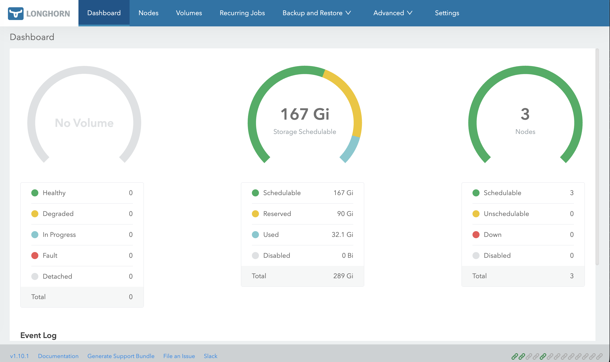
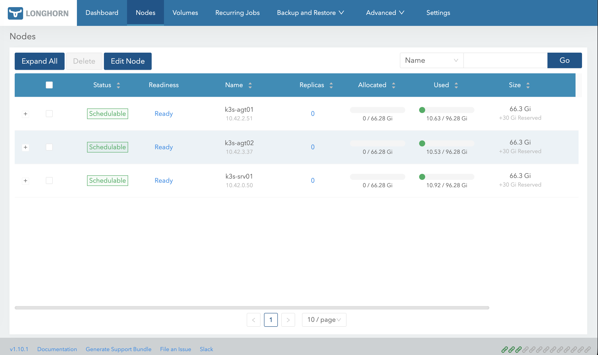

# K3s + Longhorn 3-node configuration (Ubuntu24.01LTS)

永続ボリュームはk3sに標準で付属しているRancherのLocal Path Provisionerを無効化してLonghornを利用します。
Cephが一般的かもしれませんが、小 - 中規模程度であればLonghornがお手軽です。

| 特徴 | Longhorn | Ceph (Rook経由) |
| ------ | -------- | ------ |
| スケーラビリティ | 中小規模のクラスター向け | 大規模なエンタープライズ向け |
| 複雑さ/管理 | 導入と管理が非常に簡単 (Kubernetesネイティブ) | 複雑で、運用に専門知識が必要 |
| リソース | 軽量で、限られたリソースでも動作 | リソース消費が比較的大きい (特にCPU、メモリ、ネットワーク) |
| 機能 | 分散ブロックストレージ、スナップショット、バックアップ機能 | ブロック、ファイル、オブジェクトストレージをサポート (S3互換) |
| パフォーマンス | 小規模環境では良好、書き込み後にレプリケーションを開始するため高速な場合がある | 大規模環境で高いパフォーマンスを発揮、書き込み時に同期レプリケーションを行うため堅牢性が高い |
| ハードウェア要件 | 特別なハードウェア要件なし | 特定のハードウェア構成 (例: PLP付きSSD) が推奨される |

## 構成概要
### 1-1. 概要
-  構成: Master 1台 (srv01), Agent 2台 (agt01, agt02)
-  コンポーネント: CoreDNS, Traefik, Metrics-server (全てHelm管理/Replica:3), Longhorn (分散ストレージ)
-  ネットワーク: HTTPS (Ingress) で管理画面へアクセス
-  ストレージ: Longhorn (レプリカ数3 / 全ノードのディスクを集約)

### 1-2. ノード情報
-  Master: k3s-srv01 (192.168.1.71)
-  Agent: k3s-agt01 (192.168.1.61)
-  Agent: k3s-agt02 (192.168.1.62)

## 2. 事前準備
### 2-1. 必須カーネルモジュールのロード (dm_crypt)
Longhornのボリューム管理(暗号化機能等の依存)に必要なモジュールを有効化します。これを行わないと、ノードはReadyでもディスクが認識されません。
```linenums="0"
# 1. 今すぐモジュールをロードする
sudo modprobe dm_crypt

# 2. ロードされたか確認（何も出なければロードできていません）
lsmod | grep dm_crypt
# 出力例: dm_crypt             32768  0

# 3. 再起動後も自動でロードされるように設定ファイルに書き込む
echo "dm_crypt" | sudo tee -a /etc/modules-load.d/longhorn.conf
```
### 2-2. multipathd の無効化
Ubuntu等のデフォルトで有効な multipathd は、Longhornが管理すべきローカルディスクをロックしてしまい、使用不能にする競合原因となります。完全に停止させます。
```linenums="0"
sudo systemctl stop multipathd
sudo systemctl disable multipathd
```
### 2-3. iSCSI デーモンの有効化
```linenums="0"
sudo systemctl enable --now iscsid

# インストールされていない場合は以下のコマンドでインストール
sudo apt install open-iscsi
```
### 2-4. クリーンアップ (再構築時のみ)
既存環境がある場合は完全に削除します。
```linenums="0"
/usr/local/bin/k3s-uninstall.sh 2>/dev/null || true
/usr/local/bin/k3s-agent-uninstall.sh 2>/dev/null || true
sudo rm -rf /var/lib/rancher /etc/rancher /root/.kube /var/lib/longhorn
```

## 3. K3s Master のインストール
対象: k3s-srv01 (192.168.1.71)

標準コンポーネントを無効化し、Helmで管理しやすい素の状態を作成します。
```linenums="0"
curl -sfL https://get.k3s.io | INSTALL_K3S_EXEC="server \
  --disable coredns \
  --disable traefik \
  --disable metrics-server \
  --disable local-storage \
  --node-ip 192.168.1.71 \
  --flannel-backend=vxlan" \
  sh -

# ノードトークンの確認（Agent参加用）
sudo cat /var/lib/rancher/k3s/server/node-token
# 出力された文字列(K10...)を控える
```

## 4. K3s Agent のインストール
対象: k3s-agt01, k3s-agt02

&lt;MASTER_TOKEN&gt; を手順3で確認した文字列に置き換えて実行してください。
```linenums="0"
# 変数設定 (自ノードのIPに合わせて書き換えること)
# agt01なら 192.168.1.61, agt02なら 192.168.1.62
MY_IP="192.168.1.61"

curl -sfL https://get.k3s.io | K3S_URL=https://192.168.1.71:6443 \
  K3S_TOKEN=<MASTER_TOKEN> \
  INSTALL_K3S_EXEC="agent --node-ip ${MY_IP}" \
  sh -
```

確認 (Masterで実行):
```linenums="0"
sudo k3s kubectl get nodes

# 3台すべてが "Ready" になっていることを確認
NAME        STATUS   ROLES                  AGE     VERSION
k3s-agt01   Ready    <none>                 5d16h   v1.33.6+k3s1
k3s-agt02   Ready    <none>                 5d16h   v1.33.6+k3s1
k3s-srv01   Ready    control-plane,master   5d16h   v1.33.6+k3s1
```

## 5. Helm のセットアップ
対象: k3s-srv01 (以降の作業は全てMasterで実施)
```linenums="0"
curl -fsSL -o get_helm.sh https://raw.githubusercontent.com/helm/helm/main/scripts/get-helm-3
chmod 700 get_helm.sh
./get_helm.sh

export KUBECONFIG=/etc/rancher/k3s/k3s.yaml
```

## 6. 基盤コンポーネントの導入
### 6-1. CoreDNS (DNS権限対策済み)
Helm標準のCoreDNSはK3s環境で権限不足(NXDOMAINエラー)になることがあるため、ServiceAccountを明示的に指定します。
```linenums="0"
helm repo add coredns https://coredns.github.io/helm
helm repo update

# 設定ファイル作成
vi values-coredns.yaml
```
```title="values-coredns.yaml" linenums="0"
replicaCount: 3
serviceAccount:
  create: true
  name: coredns # 重要: ServiceAccount名を固定化
service:
  clusterIP: 10.43.0.10
deployment:
  enabled: true
servers:
- zones:
  - zone: .
  port: 53
  plugins:
  - name: errors
  - name: health
    configBlock: |-
      lameduck 5s
  - name: ready
  - name: kubernetes
    parameters: cluster.local in-addr.arpa ip6.arpa
    configBlock: |-
      pods insecure
      fallthrough in-addr.arpa ip6.arpa
      ttl 30
  - name: prometheus
    parameters: 0.0.0.0:9153
  - name: forward
    parameters: . /etc/resolv.conf
  - name: cache
    parameters: 30
  - name: loop
  - name: reload
  - name: loadbalance
```

インストール
```linenums="0"
helm install coredns coredns/coredns -n kube-system -f values-coredns.yaml
```
※補足: 万が一 DNS解決ができない場合は、coredns ServiceAccount に cluster-admin 権限を付与してください。

### 6-2. Metrics Server & Traefik
```linenums="0"
helm repo add metrics-server https://kubernetes-sigs.github.io/metrics-server/
helm repo add traefik https://traefik.github.io/charts
helm repo update

# Metrics Server (TLS無効化オプション必須)
helm install metrics-server metrics-server/metrics-server -n kube-system \
  --set replicas=3 \
  --set args={--kubelet-insecure-tls}

# Traefik (HTTPS 443ポート公開用)
helm install traefik traefik/traefik -n kube-system \
  --set deployment.replicas=3 \
  --set ports.web.nodePort=30080 \
  --set ports.websecure.nodePort=30443
```

## 7. Longhorn のインストールと設定
### 7-1. インストール
```linenums="0"
helm repo add longhorn https://charts.longhorn.io
helm repo update

vi values-longhorn.yaml
```
```title="values-longhorn.yaml" linenums="0"
persistence:
  defaultClass: true
  defaultClassReplicaCount: 3
defaultSettings:
  createDefaultDiskLabeledNodes: true # /var/lib/longhorn を自動使用
```

インストール
```linenums="0"
helm install longhorn longhorn/longhorn \
  --namespace longhorn-system \
  --create-namespace \
  -f values-longhorn.yaml
```

### 7-2. Web UI のHTTPS公開
Traefik Ingress を使用して管理画面をHTTPS(443)で公開します。
```linenums="0"
vi longhorn-ingress.yaml
```
```title="longhorn-ingress.yaml" linenums="0"
apiVersion: networking.k8s.io/v1
kind: Ingress
metadata:
  name: longhorn-ingress
  namespace: longhorn-system
  annotations:
    # HTTPアクセスをHTTPSへ強制リダイレクト
    traefik.ingress.kubernetes.io/router.entrypoints: websecure
    traefik.ingress.kubernetes.io/router.tls: "true"
spec:
  tls:
  - hosts:
    - longhorn.192.168.1.71.nip.io
  rules:
  - host: longhorn.192.168.1.71.nip.io
    http:
      paths:
      - path: /
        pathType: Prefix
        backend:
          service:
            name: longhorn-frontend
            port:
              number: 80 # 内部通信用ポート
```
設定適用
```linenums="0"
sudo k3s kubectl apply -f longhorn-ingress.yaml
```
## 8. 動作確認
ブラウザで https://longhorn.192.168.1.71.nip.io にアクセスします。

1.  Nodes: 3つ全てが Schedulable (緑色) であること。
1.  Storage: 合計容量が表示されていること。

※もし Nodes が Disabled / No Storage の場合: OS事前準備の dm_crypt や multipathd 設定が反映されていない可能性があります。設定見直し後、Web UIから以下を実施します。

1.  Nodes タブ > 対象ノードの Edit Node and Disks
1.  Scheduling: Enable
1.  Disks: Path /var/lib/longhorn, Storage Reserved(安全のためノードのリソースの30%くらい)を追加して Save。

<div style="display: flex; justify-content: center; gap: 1px;">
    
    
</div>
