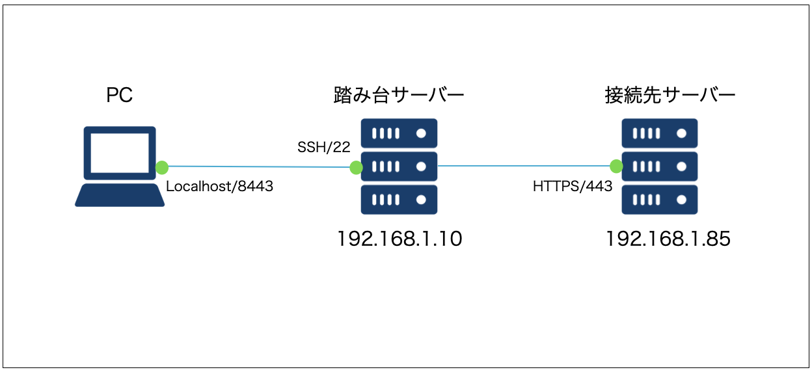

# SSH Port Forwarding

## Overview
- ローカルPCから直接接続できないサーバーのポートをローカルに転送して接続をする

## Explanatory diagram


## Method

### SSHログインと共にポート転送をする
``` linenums="0"
ssh -L [PCのローカルポート番号]:[接続先サーバのアドレス]:[接続先サーバのポート番号] [踏み台サーバのアドレス]
```

#### example
``` linenums="0"
ssh -L 8443:192.168.1.85:443 192.168.1.10
```

### ポート転送のみを実施
ログイン時にポート転送のみをおこないたい場合は、「-N」オプションを付与します。
sshによるログイン後、通常はプロンプトが表示されますが、「-N」オプションを付与するとアカウント・パスワードを入力した後、応答が戻ってこなくなります。
これでポート転送のみが行われる状態になったので、この画面は開いたままにします。

#### example
``` linenums="0"
ssh -L -N 8443:192.168.1.85:443 192.168.1.10
```
